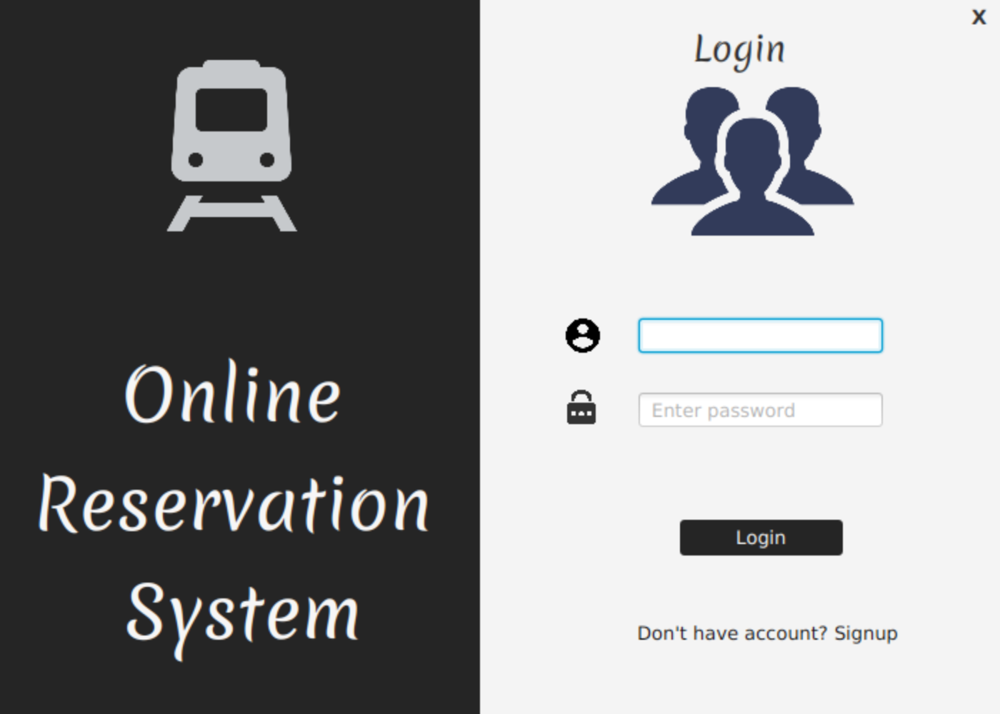
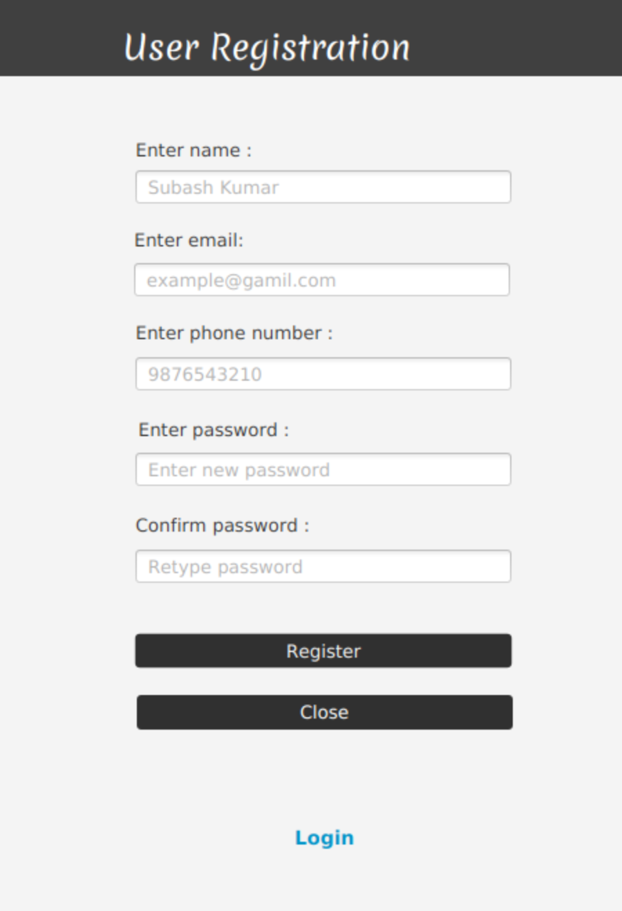
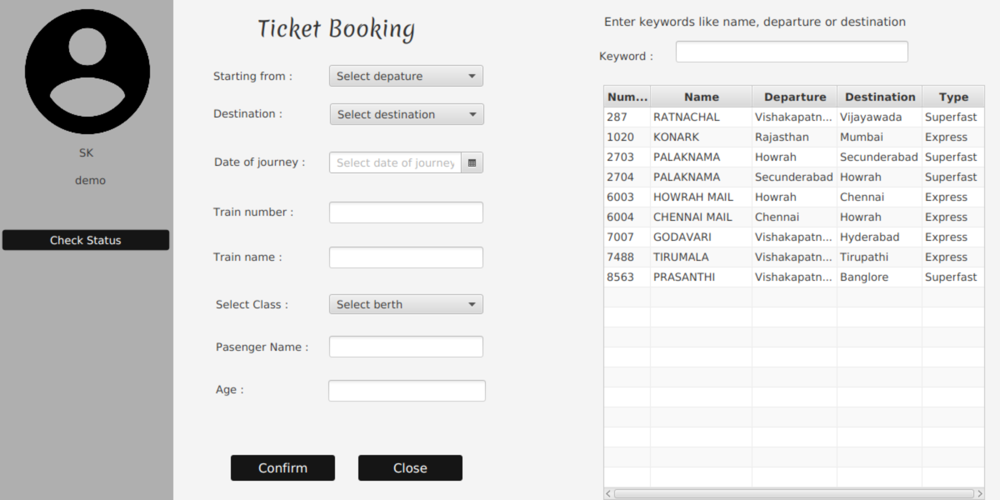
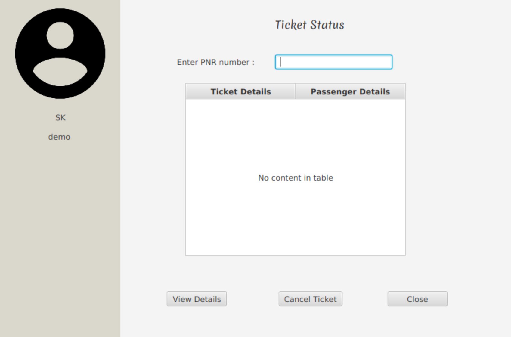

# Online Reservation System (Train Ticket Booking) - JavaFX

Welcome to the Online Reservation System project, a JavaFX application for booking train tickets online. This project provides a user-friendly interface for users to log in, register, book train tickets, and check booking status.

## Table of Contents
- [Features](#features)
- [Screenshots](#screenshots)
- [Demo video](#demovideo)
- [Prerequisites](#prerequisites)
- [Usage](#usage)

## Features
1. **Login Page**: Users can log in using their credentials to access the system.
2. **Register Page**: New users can register their accounts to use the system.
3. **Ticket Booking Page**: Users can search for available trains, select travel details, and book tickets.
4. **Status Checking Page**: Users can check the status of their booked tickets.
5. **Responsive UI**: The application has been designed using JavaFX, ensuring a responsive and user-friendly interface.

## Screenshots
- Login Page
  
- Register Page
  
- Ticket Booking Page
  
- Ticket Status Checking/Cancellation Page
  

## Demo video

## Prerequisites
- Java JDK
- JavaFX SDK

## Usage
1. Launch the application.
2. If you're a new user, click on the "Register" button to create an account.
3. If you're a returning user, log in using your credentials.
4. On the main dashboard, you can navigate to the "Ticket Booking" page to book your train tickets.
5. Use the "Status Checking" page to view the status of your booked tickets.

